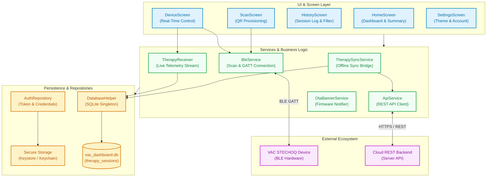
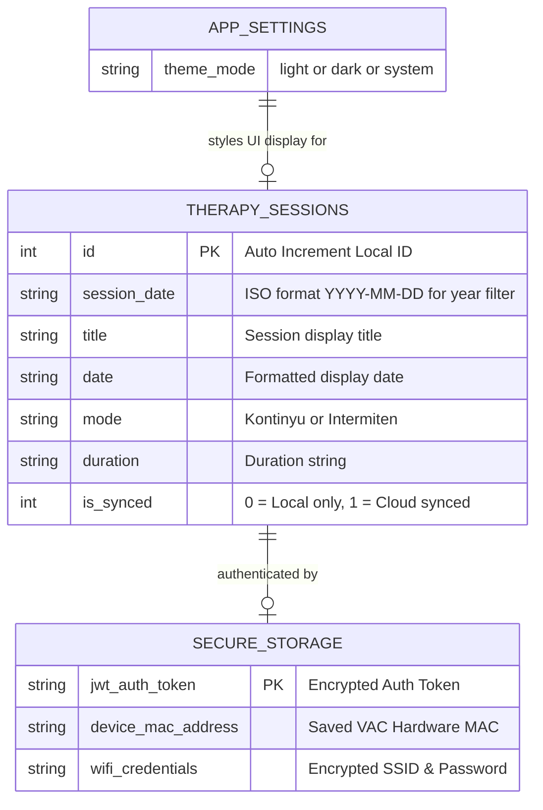
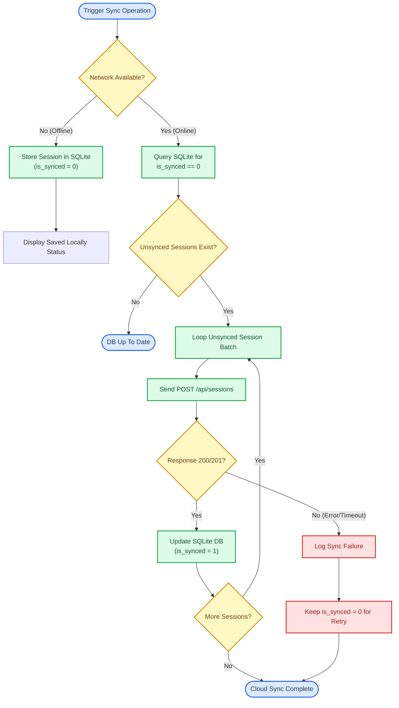
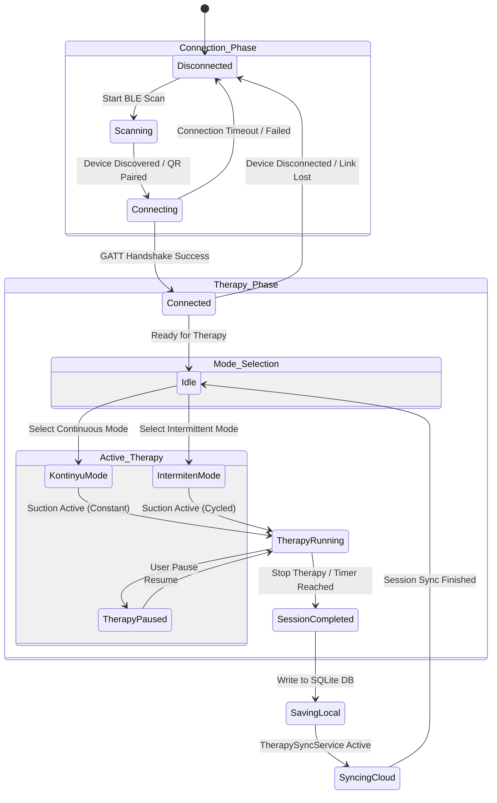
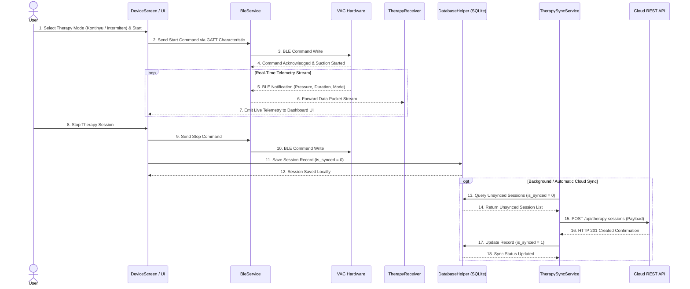

# VAC STECHOQ Dashboard App

A cross-platform Flutter application (Android, iOS, Web) for real-time therapy monitoring, device control, and session tracking for the **VAC STECHOQ** (Vacuum Assisted Closure) medical device.

The app connects over Bluetooth Low Energy (BLE) for live hardware telemetry, persists session history locally via SQLite (`sqflite`), manages auth tokens securely via `flutter_secure_storage`, and synchronizes records to the cloud REST backend.

---

## Table of Contents

- [Key Features](#-key-features)
- [Getting Started](#-getting-started)
- [Platform Notes](#-platform-notes)
- [API Configuration](#-api-configuration)
- [System Architecture](#%EF%B8%8F-system--directory-architecture)
- [Data Layer & Storage](#-data-layer--storage)
- [BLE Internals](#-ble-internals)
- [Therapy Modes & Telemetry](#-therapy-modes--ble-telemetry)
- [End-to-End Flow](#-end-to-end-therapy--data-flow)
- [Contributing](#-contributing)
- [Technology Stack](#%EF%B8%8F-technology-stack--dependencies)

---

## 📌 Key Features

- **BLE Device Pairing & Telemetry:** Connects to VAC hardware via `flutter_blue_plus`, subscribes to real-time therapy data streams, and enables device control.
- **Offline-First Therapy History:** Persists therapy session records locally in SQLite (`vac_dashboard.db`).
- **Cloud API Synchronization:** Automatically synchronizes unsynced local sessions to the remote REST backend.
- **QR Code Connectivity:** Integrated QR scanner via `mobile_scanner` for rapid device and Wi-Fi credential provisioning.
- **Adaptive Design Token System:** Cupertino & Material combined styling with automatic light/dark mode support ([lib/asset/color_tokens.dart](lib/asset/color_tokens.dart)).
- **OTA Updates Banner:** Notifies users of Over-The-Air firmware updates for the connected VAC hardware.

---

## 🚀 Getting Started

This section walks you through setting up the project from scratch on your local machine.

### Prerequisites

Before you begin, make sure the following are installed and configured:

| Requirement | Version / Notes |
| :--- | :--- |
| [Flutter SDK](https://flutter.dev/docs/get-started/install) | `^3.12.2` (check with `flutter --version`) |
| Dart SDK | Included with Flutter |
| Android Studio **or** Xcode | For emulators and device toolchains |
| Physical Android or iOS device | **Strongly recommended** — BLE and Camera do not work on most emulators |
| Git | Any recent version |

> **Android minimum SDK:** The app targets a minimum SDK version compatible with `flutter_blue_plus` and `flutter_secure_storage`. Ensure your device runs Android 8.0 (API 26) or higher.

### 1. Clone the Repository

```bash
git clone https://github.com/nashirabbash/VAC-IoT.git
cd VAC-IoT/vac_dashboard_app
```

### 2. Install Dependencies

```bash
flutter pub get
```

### 3. Configure the Backend URL

The API base URL is hardcoded in [`lib/services/api_service.dart`](lib/services/api_service.dart). If you need to point to a local or staging backend, update this constant before running:

```dart
// lib/services/api_service.dart
static const _baseUrl = 'https://be-vac-production.up.railway.app/api';
```

See [API Configuration](#-api-configuration) for full details.

### 4. Run the App

Connect a physical device, then:

```bash
flutter run
```

To run on a specific device when multiple are connected:

```bash
flutter devices          # list connected devices
flutter run -d <device-id>
```

### 5. Verify Setup

Run static analysis and the test suite to confirm everything is working:

```bash
flutter analyze
flutter test
```

A clean run of both commands means your environment is set up correctly.

### Component Sandbox

[`lib/main.dart`](lib/main.dart) contains a `ComponentSandboxPage` for interactive UI component previews — Typography, Buttons, Steppers, Grouped Lists, and Alert Dialogs. To enable it, temporarily set the home route in `main.dart` to `ComponentSandboxPage()`.

---

## 📱 Platform Notes

### Android

Permissions are declared in [`android/app/src/main/AndroidManifest.xml`](android/app/src/main/AndroidManifest.xml).

| Permission | API Level | Purpose |
| :--- | :--- | :--- |
| `BLUETOOTH` | ≤ 30 (legacy) | BLE adapter access on older Android |
| `BLUETOOTH_ADMIN` | ≤ 30 (legacy) | BLE on/off control on older Android |
| `BLUETOOTH_SCAN` | 31+ | Scan for nearby BLE devices (no location inference) |
| `BLUETOOTH_CONNECT` | 31+ | Connect to paired BLE devices |
| `ACCESS_FINE_LOCATION` | ≤ 30 | Required by BLE scan on Android 10 and below |
| `INTERNET` | All | Cloud REST API communication |
| `FOREGROUND_SERVICE` | All | Background BLE session continuity |
| `FOREGROUND_SERVICE_CONNECTED_DEVICE` | All | Foreground service type for connected BLE device |

> `BLUETOOTH_SCAN` is declared with `usesPermissionFlags="neverForLocation"` — the app does **not** use Bluetooth to derive location.

> `android:usesCleartextTraffic="true"` is set in the manifest. This is required during development if your backend does not use HTTPS. Remove it for production-only HTTPS environments.

### iOS

Privacy usage descriptions are declared in [`ios/Runner/Info.plist`](ios/Runner/Info.plist).

| Key | Description |
| :--- | :--- |
| `NSCameraUsageDescription` | "This app needs camera access to scan for VAC devices." |
| `NSMicrophoneUsageDescription` | "This app needs microphone access for camera support." |

> iOS does **not** require explicit Bluetooth permission keys in `Info.plist` since `flutter_blue_plus` handles CoreBluetooth permission requests at runtime. If you target iOS 13+, the system permission dialog is shown automatically on first BLE scan.

> A physical iOS device is required for BLE. The iOS Simulator does not support CoreBluetooth scanning.

---

## 🔌 API Configuration

### Base URL

The REST API base URL is defined as a single constant in [`lib/services/api_service.dart`](lib/services/api_service.dart):

```dart
static const _baseUrl = 'https://be-vac-production.up.railway.app/api';
```

To switch environments (e.g., local development or staging), update this value directly. There is currently no `.env` file or build flavor system — that is a future improvement opportunity.

### Authentication Flow

1. User submits credentials via the login form ([`lib/component/login_form.dart`](lib/component/login_form.dart)).
2. `ApiService.login()` sends `POST /api/auth/login` with `{ username, password }`.
3. On success, the response JWT token is saved via `AuthRepository.saveToken()` to the device Keystore/Keychain using `flutter_secure_storage`.
4. Device credentials (`deviceId`, `authPin`) extracted from the login response are also persisted securely.
5. All subsequent HTTP requests are intercepted by [`lib/network/api_interceptor.dart`](lib/network/api_interceptor.dart), which attaches the `Authorization: Bearer <token>` header automatically.

### Logout Flow

1. User triggers logout from the avatar menu in [`lib/screens/homeScreens.dart`](lib/screens/homeScreens.dart).
2. `ApiService.logout()` sends `POST /api/auth/logout`.
3. The backend returns HTTP 400 if the user still has an active device connection, with the message: _"Please disconnect the device before logging out."_
4. On HTTP 200/204, `AuthRepository.clearToken()` wipes the token, device ID, auth PIN, and username from secure storage.

### REST API Endpoints Summary

| Method | Endpoint | Purpose |
| :--- | :--- | :--- |
| `POST` | `/api/auth/login` | Authenticate user, receive JWT |
| `POST` | `/api/auth/register` | Create a new account |
| `POST` | `/api/auth/logout` | Invalidate session server-side |
| `POST` | `/api/device/bind` | Bind a QR-scanned device to account |
| `GET` | `/api/therapy-sessions` | Fetch cloud session list (optional `?year=`) |
| `POST` | `/api/therapy-sessions` | Sync a local session to the cloud |

---

## 🏗️ System & Directory Architecture

The application adopts a modular multi-tier architecture isolating user interfaces, background business logic, and local/remote persistence layers.



The application source code is organized under [lib/](lib/):

```
lib/
├── main.dart                    # Application entrypoint, theme listener & component sandbox
├── asset/                       # Design system tokens and color definitions
│   ├── color_tokens.dart        # Context-aware color tokens (AppColorTokenSet)
│   └── color.dart               # AppColors legacy color scheme
├── component/                   # Reusable UI components & design system widgets
│   ├── alert_dialog.dart        # iOS-style AppAlertDialog
│   ├── auth_bottom_sheet.dart   # Unified authentication bottom sheet
│   ├── auth_input_field.dart    # Custom authentication form input field
│   ├── bottomSheet.dart         # Standard bottom sheet wrapper
│   ├── bottom_sheet_header.dart # Header component for bottom sheets
│   ├── button.dart              # AppButton (primary, secondary, danger, ghost)
│   ├── card.dart                # Therapy session card item
│   ├── forgot_password_form.dart# Password reset form
│   ├── grouped_list.dart        # iOS-style grouped list view & tiles
│   ├── header.dart              # AppHeader widget (compact, large, inline)
│   ├── login_form.dart          # Login form widget
│   ├── menu.dart                # Context menu & action sheet
│   ├── mode_badge.dart          # Therapy mode visual badge
│   ├── ota_notification.dart    # OTA firmware update notification banner
│   ├── register_form.dart       # Registration form widget
│   ├── sectionHistory.dart      # Grouped therapy history list section
│   ├── splitButton.dart         # Dual-action split button widget
│   ├── stepper.dart             # Custom increment/decrement stepper
│   └── text.dart                # AppText typography system
├── data/                        # Local mock & seed data
│   └── dummyData.json           # Development fallback dataset
├── db/                          # Database persistence layer
│   └── database_helper.dart     # SQLite singleton manager & queries
├── models/                      # Business & data transfer models
│   ├── auth_form_data.dart      # Auth form state validation model
│   ├── device_credentials.dart  # VAC device connection credentials
│   ├── register_dto.dart        # Registration payload DTO
│   └── therapy_session.dart     # TherapySession entity model
├── network/                     # Network middleware
│   └── api_interceptor.dart     # HTTP request interceptor & error handler
├── repositories/                # Data repository layer
│   ├── auth_repository.dart     # Secure token & credential persistence
│   └── settings_repository.dart # Preferences repository (theme mode)
├── screens/                     # Primary user interface screens
│   ├── homeScreens.dart         # Main dashboard & active session summary
│   ├── historyScreens.dart      # Session history list & year filtering
│   ├── deviceScreens.dart       # Real-time BLE device control screen
│   ├── scanScreens.dart         # QR code device scanning screen
│   ├── settingsScreen.dart      # Settings, theme toggle & account details
│   ├── welcomeScreens.dart      # Onboarding welcome screen
│   └── wifiScreens.dart         # VAC device Wi-Fi configuration screen
├── services/                    # Business logic & background services
│   ├── api_service.dart         # REST API client service
│   ├── ble_service.dart         # BLE scanning, connecting & GATT characteristic streams
│   ├── ota_banner_service.dart  # OTA firmware update banner manager
│   ├── therapy_receiver.dart    # Live therapy packet stream handler
│   └── therapy_sync_service.dart# Synchronization bridge between SQLite and Cloud API
└── utils/                       # Utility helpers
    ├── mode_color.dart          # Therapy mode visual badge color resolver
    └── text_styles.dart         # Typography text style utilities
```

---

## 💾 Data Layer & Storage

### SQLite Local Database

Managed by [`DatabaseHelper`](lib/db/database_helper.dart) (`vac_dashboard.db`, schema version `2`).

#### Table: `therapy_sessions`

| Column | Type | Modifiers | Description |
| :--- | :--- | :--- | :--- |
| `id` | `INTEGER` | `PRIMARY KEY AUTOINCREMENT` | Local session record identifier |
| `session_date` | `TEXT` | `NOT NULL` | ISO date string (`YYYY-MM-DD...`) used for year filtering |
| `title` | `TEXT` | `NOT NULL` | Session title / display name |
| `date` | `TEXT` | `NOT NULL` | User-formatted date string |
| `mode` | `TEXT` | `NOT NULL` | Therapy mode (`Kontinyu` or `Intermiten`) |
| `duration` | `TEXT` | `NOT NULL` | Session duration string |
| `is_synced` | `INTEGER` | `NOT NULL DEFAULT 0` | `0` = local only, `1` = synced to cloud |

#### Available DatabaseHelper Methods

| Method | Description |
| :--- | :--- |
| `insert(session)` | Insert a new therapy session |
| `getAll()` | Retrieve all sessions |
| `getByYear(year)` | Retrieve sessions filtered by year string |
| `getYears()` | Retrieve list of distinct years in the database |
| `update(session)` | Update an existing session record |
| `delete(id)` | Delete a session by ID |

### Entity Relationship Diagram



### Offline-First Cloud Synchronization Flow



### Secure Credentials Storage

[`AuthRepository`](lib/repositories/auth_repository.dart) uses `flutter_secure_storage` to encrypt sensitive data via Keystore (Android) and Keychain (iOS).

| Secure Storage Key | Content |
| :--- | :--- |
| `jwt_token` | JWT Bearer token from `/api/auth/login` |
| `device_id` | VAC hardware device identifier (BLE name) |
| `auth_pin` | Device authentication PIN for BLE handshake |
| `username` | Logged-in username (display and fallback decode) |

**Self-healing fallback:** If `device_id` is missing from secure storage (e.g., after a fresh install), `AuthRepository.getDeviceCredentials()` decodes the JWT payload and extracts `deviceId` from it automatically, then persists it for subsequent reads.

---

## 📡 BLE Internals

All BLE communication is managed by [`BleService`](lib/services/ble_service.dart) using the `flutter_blue_plus` package.

### GATT Profile

The VAC STECHOQ hardware exposes a single GATT service with two characteristics:

| Role | UUID | Direction | Description |
| :--- | :--- | :--- | :--- |
| **Service** | `4fafc201-1fb5-459e-8fcc-c5c9c331914b` | — | Primary GATT service |
| **RX Char** | `c083b0f6-bb21-4f15-8120-d4f13b28b7e2` | App → Device (Write) | Command channel — app writes JSON commands here |
| **TX Char** | `6e400003-b5a3-f393-e0a9-e50e24dcca9e` | Device → App (Notify) | Telemetry channel — device notifies JSON events here |

### Connection Lifecycle



### Post-Connection Handshake

Immediately after GATT service discovery succeeds, `BleService` performs two automated steps:

1. **Authentication** — sends `{ "type": "auth", "pin": "<authPin>" }` to the RX characteristic if an `authPin` is stored.
2. **Time Sync** — sends `{ "type": "time_sync", "timestamp": <unix_epoch_seconds> }` to align the device clock.

### JSON Command Protocol

All messages on the RX channel are UTF-8 encoded JSON objects. The `type` field is always present.

**Commands the app sends (App → Device via RX):**

| `type` | Payload fields | Description |
| :--- | :--- | :--- |
| `auth` | `pin` | Device authentication handshake |
| `time_sync` | `timestamp` | Unix epoch (seconds) clock alignment |
| `wifi_config` | `ssid`, `password` | Provision Wi-Fi credentials |
| `wifi_disconnect` | — | Disconnect device from Wi-Fi |
| `get_status` | — | Request current Wi-Fi connection status |

**Events the device sends (Device → App via TX Notify):**

| `type` / key | Description |
| :--- | :--- |
| `therapy_event` or `therapy` | Therapy session data packet (triggers `TherapyReceiver.save()`) |
| `wifi_status` | Wi-Fi connection status update with optional `ssid` field |
| Presence of `start` key | Alternate therapy event format (used to deduplicate sessions via `_lastStart`) |

### RSSI Proximity Monitoring

`BleService` polls RSSI every **4 seconds** after connecting. If the signal drops below **-85 dBm** for **3 consecutive readings**, the service automatically disconnects. This prevents the device from staying "connected" when the user has walked out of range.

### Auto-Reconnect Behavior

| Trigger | Behavior |
| :--- | :--- |
| Connection timeout / GATT failure | Retry scan after 3 seconds |
| Unexpected disconnection (link lost) | Retry scan after 5 seconds (if not explicitly disconnected) |
| User-initiated disconnect (`disconnect()`) | No auto-reconnect; sets `isExplicitlyDisconnected = true` |
| New login session (`resetForNewSession()`) | Clears the explicit disconnect guard, re-enables auto-reconnect |

---

## ⚡ Therapy Modes & BLE Telemetry

The VAC STECHOQ device operates in two primary therapy modes:

| Mode | Visual Badge Color | Description |
| :--- | :--- | :--- |
| **Kontinyu (Continuous)** | Blue | Continuous negative pressure wound therapy |
| **Intermiten (Intermittent)** | Orange | Cycled suction and release intervals |

Badge colors are resolved by [`lib/utils/mode_color.dart`](lib/utils/mode_color.dart) via `modeBadgeColor(mode)`.

Live telemetry packets received over BLE via [`therapy_receiver.dart`](lib/services/therapy_receiver.dart) are processed in real-time, displayed on [`deviceScreens.dart`](lib/screens/deviceScreens.dart), and persisted to SQLite upon session completion.

---

## 🔄 End-to-End Therapy & Data Flow

The following sequence illustrates the complete path from therapy start to cloud sync.



---

## 🤝 Contributing

### Branch Conventions

| Branch prefix | Purpose |
| :--- | :--- |
| `feat/` | New feature |
| `fix/` | Bug fix |
| `refactor/` | Code restructuring without behavior change |
| `docs/` | Documentation updates only |
| `chore/` | Maintenance tasks (deps, configs) |

Example: `feat/ota-progress-indicator`, `fix/ble-reconnect-loop`.

### Before Submitting

Run both checks and fix any issues before opening a pull request:

```bash
flutter analyze   # must exit with 0 issues
flutter test      # all tests must pass
```

### Adding a New Screen

1. Create the screen file under `lib/screens/`.
2. Register it in the appropriate navigation flow in `lib/main.dart`.
3. Use `context.colors.<token>` from [`lib/asset/color_tokens.dart`](lib/asset/color_tokens.dart) for all colors — never hardcode `Colors.black` or `Colors.white`.
4. Use `AppText` from [`lib/component/text.dart`](lib/component/text.dart) for all typography.

### Adding a New API Endpoint

1. Add a method to [`lib/services/api_service.dart`](lib/services/api_service.dart).
2. Use the existing `_client` (which is an `ApiInterceptor`) — do not create a raw `http.Client`.
3. Throw `ApiException` for error responses so callers can handle them uniformly.

### Adding a New BLE Command

1. Add a method to [`lib/services/ble_service.dart`](lib/services/ble_service.dart) that calls `send(type, payload)`.
2. If the command expects a response, add a handler branch in `handleIncomingBytes()`.
3. Document the new `type` string and expected payload fields in the [BLE Internals](#-ble-internals) section of this README.

---

## 🛠️ Technology Stack & Dependencies

### Runtime Dependencies

| Package | Version | Purpose |
| :--- | :--- | :--- |
| Flutter SDK | `^3.12.2` | Core application framework |
| `sqflite` | `^2.4.3` | Local SQLite database engine |
| `flutter_blue_plus` | `^1.32.12` | BLE scanning, connecting, and GATT streaming |
| `flutter_secure_storage` | `^10.3.1` | Encrypted storage for JWT tokens and device credentials |
| `http` | `^1.3.0` | REST API HTTP client |
| `mobile_scanner` | `^7.2.0` | QR code scanner engine |
| `camera` | `^0.10.6` | Camera hardware module integration |
| `path` | `^1.9.1` | Cross-platform file path helper |

### Development Dependencies

| Package | Version | Purpose |
| :--- | :--- | :--- |
| `flutter_test` | `sdk: flutter` | Unit and widget testing framework |
| `flutter_lints` | `^6.0.0` | Recommended lint rules |
| `mocktail` | `^1.0.5` | Mocking library for Dart tests |
| `flutter_native_splash` | `^2.4.6` | Native launch splash screen generator |
