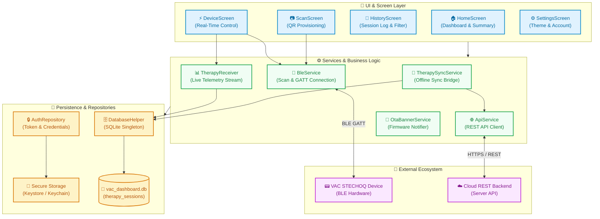
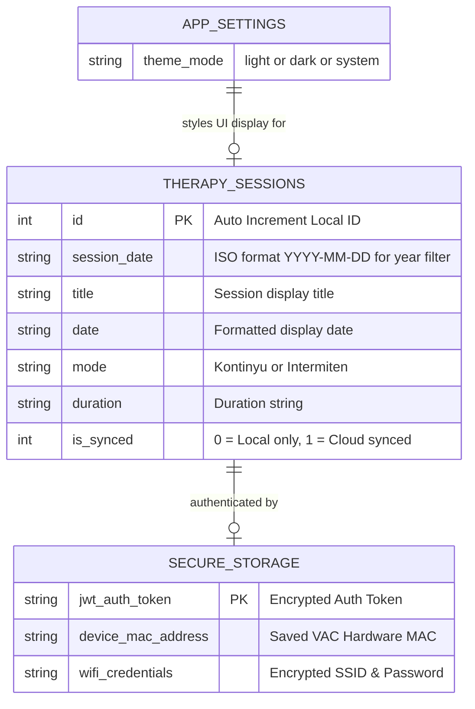
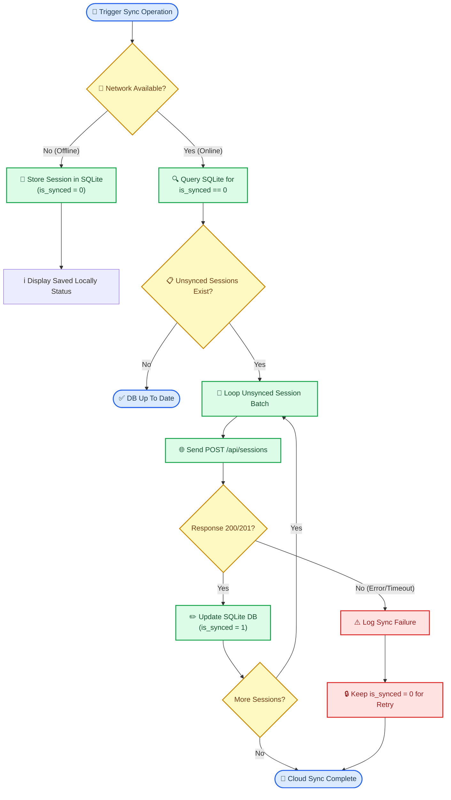
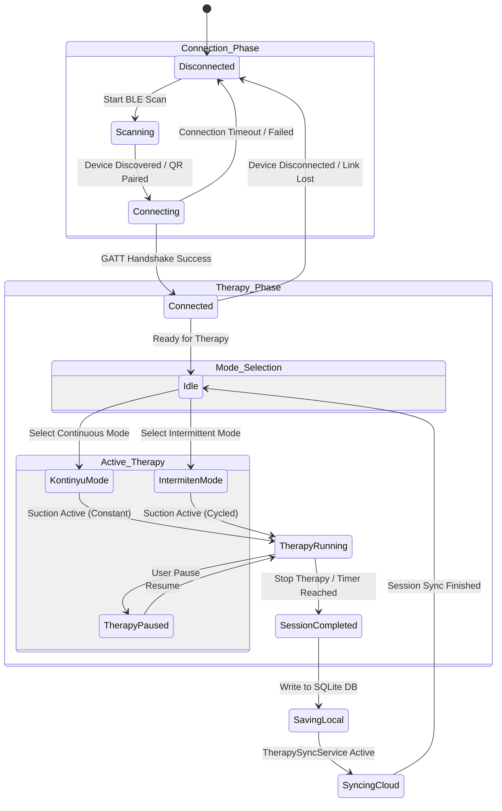
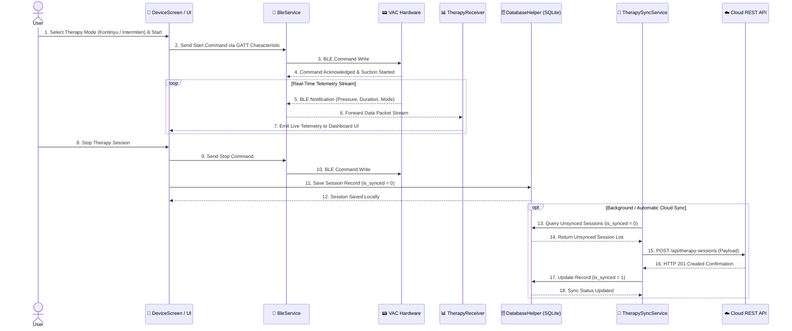

# VAC STECHOQ Dashboard App

A cross-platform Flutter application (Android, iOS, Web) designed for real-time therapy monitoring, device control, and session tracking for the **VAC STECHOQ** (Vacuum Assisted Closure) medical device.

The app supports Bluetooth Low Energy (BLE) connectivity for live hardware telemetrics, offline-first local session history storage via SQLite (`sqflite`), secure authentication token management (`flutter_secure_storage`), cloud REST API synchronization, and adaptive dark/light design token styling.

## 📖 Technical Overview & Diátaxis Framework

This documentation is structured according to the [Diátaxis Framework](https://diataxis.fr/) across four distinct documentation quadrants:

- **Tutorials:** Step-by-step onboarding walkthrough for developers joining the project.
- **How-to Guides:** Actionable instructions for environment setup, app execution, static analysis, unit testing, and using the component sandbox.
- **Reference:** Technical specifications including SQLite database schema, dependency catalog, and codebase directory layout.
- **Explanation:** In-depth technical discussions on architecture design, BLE stream processing, offline synchronization, and state management.

## 📌 Key Features

- **BLE Device Pairing & Telemetry:** Connects to VAC hardware via `flutter_blue_plus`, subscribes to real-time therapy data streams, and enables device control.
- **Offline-First Therapy History:** Persists therapy session records in a local SQLite database (`vac_dashboard.db`).
- **Cloud API Synchronization:** Automatically or manually synchronizes unsynced local session records to the remote REST backend.
- **QR Code Connectivity:** Integrated QR scanner via `mobile_scanner` for rapid device and Wi-Fi credential provisioning.
- **Adaptive Design Token System:** Cupertino & Material combined styling with automatic light/dark mode support ([lib/asset/color_tokens.dart](lib/asset/color_tokens.dart)).
- **OTA Updates Banner:** Notifies users of Over-The-Air firmware updates for connected VAC hardware.

## 🛠️ Technology Stack & Dependencies

### Runtime Dependencies (`dependencies`)

| Dependency | Version | Purpose |
| :--- | :--- | :--- |
| **Flutter SDK** | `^3.12.2` | Core application framework |
| **sqflite** | `^2.4.3` | Local SQLite database engine |
| **flutter_blue_plus** | `^1.32.12` | Bluetooth Low Energy scanning, connecting, and streaming |
| **flutter_secure_storage** | `^10.3.1` | Encrypted storage for JWT auth tokens and device credentials |
| **http** | `^1.3.0` | REST API HTTP client |
| **mobile_scanner** | `^7.2.0` | QR Code scanner engine |
| **camera** | `^0.10.6` | Camera hardware module integration |
| **path** | `^1.9.1` | Cross-platform file path helper |

### Development & Build Dependencies (`dev_dependencies`)

| Dependency | Version | Purpose |
| :--- | :--- | :--- |
| **flutter_test** | `sdk: flutter` | Unit and widget testing framework |
| **flutter_lints** | `^6.0.0` | Recommended lint rules for Flutter apps |
| **mocktail** | `^1.0.5` | Mocking library for Dart testing |
| **flutter_native_splash** | `^2.4.6` | Native launch splash screen generator |

## 🏗️ System & Directory Architecture

The application adopts a modular multi-tier architecture isolating user interfaces, background business logic, and local/remote persistence layers.



The application source code is organized under [lib/](lib/):

```
lib/
├── main.dart                    # Application entrypoint, theme listener & component sandbox
├── asset/                       # Design system tokens and color definitions
│   ├── color_tokens.dart        # Context-aware color tokens (AppColorTokenSet)
│   └── color.dart               # AppColors legacy color scheme
├── component/                   # Reusable UI components & design system widgets
│   ├── alert_dialog.dart        # iOS-style AppAlertDialog
│   ├── auth_bottom_sheet.dart   # Unified authentication bottom sheet
│   ├── auth_input_field.dart    # Custom authentication form input field
│   ├── bottomSheet.dart         # Standard bottom sheet wrapper
│   ├── bottom_sheet_header.dart # Header component for bottom sheets
│   ├── button.dart              # AppButton (primary, secondary, danger, ghost)
│   ├── card.dart                # Therapy session card item
│   ├── forgot_password_form.dart# Password reset form
│   ├── grouped_list.dart        # iOS-style grouped list view & tiles
│   ├── header.dart              # AppHeader widget (compact, large, inline)
│   ├── login_form.dart          # Login form widget
│   ├── menu.dart                # Context menu & action sheet
│   ├── mode_badge.dart          # Therapy mode visual badge
│   ├── ota_notification.dart    # OTA firmware update notification banner
│   ├── register_form.dart       # Registration form widget
│   ├── sectionHistory.dart      # Grouped therapy history list section
│   ├── splitButton.dart         # Dual-action split button widget
│   ├── stepper.dart             # Custom increment/decrement stepper
│   └── text.dart                # AppText typography system
├── data/                        # Local mock & seed data
│   └── dummyData.json           # Development fallback dataset
├── db/                          # Database persistence layer
│   └── database_helper.dart     # SQLite singleton manager & queries
├── models/                      # Business & data transfer models
│   ├── auth_form_data.dart      # Auth form state validation model
│   ├── device_credentials.dart  # VAC device connection credentials
│   ├── register_dto.dart        # Registration payload DTO
│   └── therapy_session.dart     # TherapySession entity model
├── network/                     # Network middleware
│   └── api_interceptor.dart     # HTTP request interceptor & error handler
├── repositories/                # Data repository layer
│   ├── auth_repository.dart     # Secure token & credential persistence
│   └── settings_repository.dart # Preferences repository (theme mode)
├── screens/                     # Primary user interface screens
│   ├── homeScreens.dart         # Main dashboard & active session summary
│   ├── historyScreens.dart      # Session history list & year filtering
│   ├── deviceScreens.dart       # Real-time BLE device control screen
│   ├── scanScreens.dart         # QR code device scanning screen
│   ├── settingsScreen.dart      # Settings, theme toggle & account details
│   ├── welcomeScreens.dart      # Onboarding welcome screen
│   └── wifiScreens.dart         # VAC device Wi-Fi configuration screen
├── services/                    # Business logic & background services
│   ├── api_service.dart         # REST API client service
│   ├── ble_service.dart         # BLE scanning, connecting & GATT characteristic streams
│   ├── ota_banner_service.dart  # OTA firmware update banner manager
│   ├── therapy_receiver.dart    # Live therapy packet stream handler
│   └── therapy_sync_service.dart# Synchronization bridge between SQLite and Cloud API
└── utils/                       # Utility helpers
    ├── mode_color.dart          # Therapy mode visual badge color resolver
    └── text_styles.dart         # Typography text style utilities
```

## 💾 Data Layer & Storage

### SQLite Local Database
Managed by [DatabaseHelper](lib/db/database_helper.dart) (`vac_dashboard.db`, Version `2`).

#### Table Schema: `therapy_sessions`

| Column | Data Type | Modifiers | Description |
| :--- | :--- | :--- | :--- |
| `id` | `INTEGER` | `PRIMARY KEY AUTOINCREMENT` | Local session record identifier |
| `session_date` | `TEXT` | `NOT NULL` | ISO Date string (`YYYY-MM-DD...`) used for year filtering |
| `title` | `TEXT` | `NOT NULL` | Session title / display name |
| `date` | `TEXT` | `NOT NULL` | User-formatted date string |
| `mode` | `TEXT` | `NOT NULL` | Therapy mode (`Kontinyu` or `Intermiten`) |
| `duration` | `TEXT` | `NOT NULL` | Therapy session duration |
| `is_synced` | `INTEGER` | `NOT NULL DEFAULT 0` | `0` = Unsynced local session, `1` = Synced to cloud |

### Entity Relationship Diagram



### Offline-First Cloud Synchronization Flow



### Secure Credentials Storage
The [AuthRepository](lib/repositories/auth_repository.dart) utilizes `flutter_secure_storage` to encrypt sensitive user authorization tokens and device connection credentials via Keystore on Android and Keychain on iOS.

## ⚡ Therapy Modes & BLE Telemetry

The VAC STECHOQ device operates in two primary therapy modes:

| Mode | Visual Badge Color | Description |
| :--- | :--- | :--- |
| **Kontinyu (Continuous)** | `Blue` | Continuous negative pressure wound therapy. |
| **Intermiten (Intermittent)** | `Orange` | Cycled suction and release intervals. |

Live telemetry packets received over Bluetooth Low Energy via [therapy_receiver.dart](lib/services/therapy_receiver.dart) are processed real-time, displayed on [deviceScreens.dart](lib/screens/deviceScreens.dart), and persisted to SQLite upon session completion.

### Device State & Connection Lifecycle



## 🔄 End-to-End Therapy & Data Flow

The following sequence illustrates how therapy commands, live telemetry streams, local storage persistence, and remote cloud REST API synchronization interact during an end-to-end therapy session.



## 🚀 How-to: Developer Walkthrough & Setup

### Prerequisites
- [Flutter SDK](https://flutter.dev/docs/get-started/install) version `^3.12.2`
- Android Studio or Xcode configured for mobile development
- Physical Android or iOS device (recommended for Bluetooth BLE and Camera testing)

### Getting Started (Tutorial)
1. **Clone the repository** and navigate to the project directory:
   ```bash
   git clone https://github.com/nashirabbash/VAC-IoT.git
   cd vac_dashboard_app
   ```
2. **Install dependencies:**
   ```bash
   flutter pub get
   ```
3. **Launch the application** on a connected device:
   ```bash
   flutter run
   ```

### Code Quality & Testing
Run static analysis and the test suite:
```bash
flutter analyze
flutter test
```

### Component Sandbox
For interactive UI component testing, `ComponentSandboxPage` inside [lib/main.dart](lib/main.dart) provides live showcases for Typography, Buttons, Steppers, Grouped Lists, and Custom Alert Dialogs.
